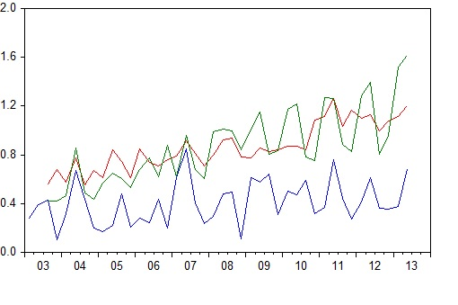

<br>

# Introdução e Conceitos Preliminares

<br>

A **Análise de Série Temporal** consiste no uso de técnicas estatísticas para identificar padrão de comportamento de dados cronológicos e ajustar modelos para previsão. 

Os **modelos de séries temporais** diferem dos **modelos econométricos tradicionais** porque não se baseiam em um modelo fornecido pela teoria econômica, que estabelece uma relação entre as variáveis econômicas. Por isso, são chamados de **ateóricos**. 

Uma **Série Temporal** é qualquer conjunto de dados ordenados no tempo, com cada valor associado a um instante de tempo.

<br>

# Modelos Univariados e Multivariados

<br>

A análise de uma série de dados é chamada de *análise univariada* e conduz à utilização de *modelos univariados* de séries temporais.

Considere $Y_t, t=1,2,3...,T$ uma série de preços de manga Palmer ao produtor do Vale do São Francisco, como a demonstrada no gráfico abaixo.

<br>

```{r econ1, warning=FALSE, message=FALSE}
#Verificando o diretorio que o R está direcionado
getwd()

#Direcionado o R para o Diretorio a ser trabalhado
setwd('c:/Users/Joao Ricardo Lima/Dropbox/tempecon/dados_manga')

#Limpa o Ambiente Global
rm(list=ls())

#Inicio do Script
#Pacotes a serem utilizados 
library(foreign)
library(mFilter)
library(forecast)
library(dplyr)
library(tsutils)
library(xts)
library(ggthemes)
library(FinTS)
library(scales)
library(ggplot2)
#library(easyGgplot2)
library(quantmod)

options(digits=4)

#Entrando dados no R

dados <- read.csv2('dados_manga_palmer_semana.csv', header=T, sep=";", dec=".")
dados <- dados[,5] #ficar apenas com a 5 coluna

#Setando como série temporal
dadosp <- ts(dados, start=c(2012,01), freq=52)

#Grafico da evolucao do preco da Manga Palmer
start(dadosp)
end(dadosp)

plot(dadosp, main='Preco Mensal de Manga Palmer - Vale',
     xlab='(meses)', ylab='Reais (R$)', lwd=3)
axis(1, at=c(2012:2022))
```

<br>
A análise de duas ou mais séries de dados é chamada de análise multivariada e envolve modelos multivariados; 

<br>
{width=85%}
<br>

# Análise Clássica e Moderna

<br> 
Até o início da década de 70 o estudo de séries temporais se dava por meio de uma *abordagem clássica* que procura decompor a série em componentes.

Os componentes não observáveis de uma série temporal são Tendência (T), Ciclo (C), Sazonalidade (S) e Variações Irregulares/Volatidade (I).

A idéia básica é que o valor da série em um dado instante de tempo é resultante da combinação de um ou mais destes 4 componentes.

<br>

```{r econ2, warning=FALSE, message=FALSE}
#Decompor a Serie
decompa <- decompose(dadosp, type = 'additive')
plot(decompa)
```

<br>

A abordagem moderna considera a série como gerada por um mecanismo de natureza aleatória denominado **processo estocástico}

Um **processo estocástico** é uma coleção de variáveis aleatórias ordenadas no tempo; 
Se consideramos Y como uma variável aleatória, e se Y for uma variável discreta, denominamos de $Y_t$, com cada t identificando um ponto no tempo, ou seja $Y_{2012m01}, Y_{2012m02}, Y_{2012m03}, ..., Y_{2019m07}, Y_{2019m08}$ para os dados mensais de preços de manga Palmer, ao produtor do Vale do São Francisco. 

Em Julho de 2019 o preço de manga Palmer, ao produtor, foi de R\$1,88. Em agosto, está R\$2,00. Contudo, em teoria, o preço poderia ser qualquer outro, dependendo da demanda, da quantidade produzida, da qualidade da fruta, etc.

Assim, o valor de R\$1,88 e R\$2,00 são **realizações** particulares de todas as tais possibilidades de preços.

Assim, pode-se considerar que a variável preço de manga Palmer, ao produtor, é um processo estocástico e os valores reais observados no período são particulares realizações deste processo.

<br>

# Objetivos da Análise de Séries Temporais

<br>

Basicamente se estuda Séries Temporais com os seguintes objetivos:
  
1) Descrever o comportamento da série, ou seja, verificar se possui algum padrão sistemático como tendência e periodicidades.

2) Investigar o mecanismo gerador pela especificação e estimação de um modelo que representa o processo gerador da série.

3) Previsão com uso de modelos uni ou multivariados.

<br>

# Defasagens e Avanços

<br>

A série temporal é uma sequencia de observações ordenadas no tempo e tem a característica de possuir altas correlações entre os valores de diferentes pontos da série.

Um valor alto no instante t é, em grande parte, resultado de um alto(baixo) em t-1, indicando uma correlação positiva(negativa).

Esta correlação é feito relacionado defasagens/lags ou avanços.

Estas defasagens ou avanços são novas variáveis que podem ser analisadas como qualquer outra

<br>

# Operadores

<br>

Os **operadores** são usados com a finalidade de simplificar a notação e facilitar as manipulações de séries temporais.

É um símbolo ou letra que, quando aplicado à uma série, define uma transformação/operação na série.

L é utilizado para definir uma defasagem. Define-se:

$$L^kY_t=Y_{t-k}$$

ou seja, $L^k$ precedendo $Y_t$ significa $Y_t$ defasado de k períodos.

para k=0, $L^0Y_t=Y_t$  

para k=1, $L^1Y_t=Y_{t-1}$  

para k=2, $L^2Y_t=L(LY_t)=LY_{t-1}=Y_{t-2}$   

e assim, sucessivamente!

```{r econ3, warning=FALSE, message=FALSE}
#Defasagens da Serie
l1dadosp <- Lag(dadosp, k=-1)
head(dadosp)
head(l1dadosp)

#Defasagens da Serie
l2dadosp <- Lag(dadosp, k=-2)
head(dadosp)
head(l1dadosp)
head(l2dadosp)

tail(dadosp)
tail(l1dadosp)
tail(l2dadosp)

```

# Operador de diferença $(\Delta$)

O operador de diferença $\Delta$ em uma série temporal gera uma nova série formada por diferenças sucessivas da série. Define-se $\Delta^dY_t$ como a série $Y_t$ diferenciada sequencialmente ``d'' vezes; 

Assim, para d=1, tem-se
$$
\Delta Y_t=Y_t-Y_{t-1}
$$ 
Para d=2, tem-se
$$
  \Delta^2 Y_t=\Delta(\Delta Y_t)=\Delta(Y_t-Y_{t-1})
$$
$$
  =\Delta Y_t-\Delta Y_{t-1}=Y_t-Y_{t-1}-(Y_{t-1}-Y_{t-2})
$$
$$
  \Delta^2 Y_t=Y_t-2Y_{t-1}+Y_{t-2}
$$

Existe uma relação entre L e $\Delta$, dada por

$$
  \Delta Y_t=Y_t-Y_{t-1}
$$ 
$$
  \Delta Y_t=Y_t-LY_t
$$

$$
  \Delta Y_t=(1-L)Y_t
$$ 
então, $\Delta=1-L$

<br>

```{r econ4, warning=FALSE, message=FALSE}
#Diferenciacao da Serie
ddadosp <- diff(dadosp)

head(dadosp)
head(ddadosp)

#Grafico da serie
plot(ddadosp, main='Preco Mensal de Manga Palmer - Vale - 1 Diferenca',
     xlab='(meses)', ylab='Reais (R$)', lwd=3)
axis(1, at=c(2012:2020))

#2 Diferenciacao da Serie
d2dadosp <- diff(dadosp, differences = 2)

head(dadosp)
head(d2dadosp)

#Grafico da serie
plot(d2dadosp, main='Preco Mensal de Manga Palmer - Vale - 2 Diferenca',
     xlab='(meses)', ylab='Reais (R$)', lwd=3)
axis(1, at=c(2012:2020))
```


# Análise dos Componentes da série temporal

O enfoque clássico da econometria de séries temporais busca decompor a série em quatro componentes:  
  
1) Tendencia (T): Componente da série que possui movimento contínuo, para cima ou baixo, por um período longo de tempo;  

2) Ciclo (C): Componente que apresenta movimento oscilatório ao longo da tendência durante um período de tempo maior do que um ano, nao necessariamente regular;  

3) Sazonalidade: Componente que apresenta movimento oscilatório que ocorre com regularidade em subperíodos de um período de tempo fixo;

4) Volatilidade (I): Componente aleatório;

Os objetivos da análise clássica são:  
  
1) Isolar o componente e analisar a série ``branqueada'', ou seja, sem o componente;  

2) Isolar e analisar o comportamento do componente;  

A decomposição dos componentes pode ser feita considerando que o modelo seja aditivo ou multiplicativo. No caso aditivo, é indicado quando os componentes são independentes,

$$ Y_t=T_t+C_t+S_t+\epsilon_t $$

No multiplicativo, são dependentes

$$ Y_t=T_t.C_t.S_t.\epsilon_t $$
Em geral, o modelo multiplicativo é apropriado quando a variação do padrão sazonal ou ao redor da componente ciclo-tendência aparentar dependência com outros componentes, como a tendência.

O modelo aditivo é mais apropriado quando estes componentes não forem proporcionais à magnitude dos dados, ou seja, forem independentes uns dos outros.

```{r econ5, warning=FALSE, message=FALSE}
#Decompor a Serie
decompa <- decompose(dadosp, type = 'additive')
plot(decompa)

decompam <- decompose(dadosp, type = 'multiplicative')
plot(decompam)
```
